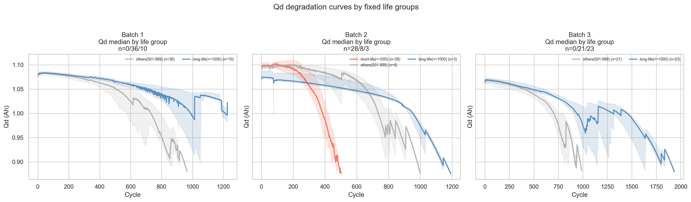
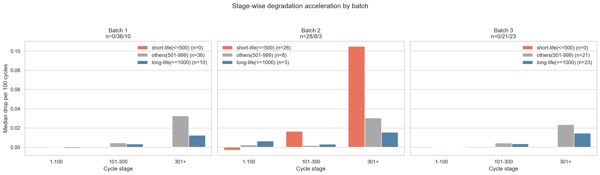
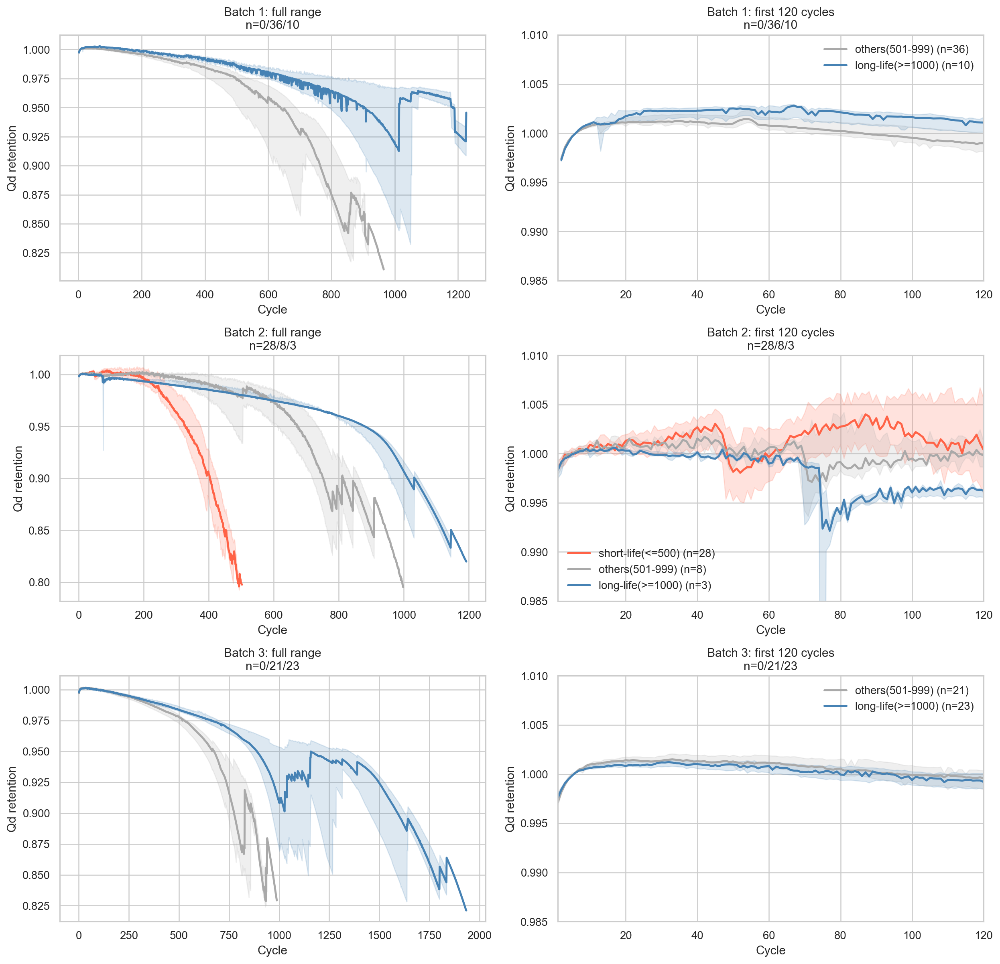

# ESS 배터리 수명 예측 보고서

## Executive Summary

본 프로젝트는 MIT-Stanford Battery Dataset을 이용해 초기 100 cycle만으로 배터리의 `cycle_life`를 예측하는 회귀 문제를 다룬다. 학습은 `Batch 1`, 평가는 `Batch 2`에서 수행했으며, 실험 결과 배치 간 분포 차이가 매우 커서 random split보다 `charging_policy` 기반 그룹 검증이 더 적절하다는 점을 확인했다.

EDA에서는 장수명 셀이 초기 열화가 더 완만하고 retention을 오래 유지한다는 점, 그리고 후반부로 갈수록 열화 속도가 가속된다는 점을 확인했다. 이를 바탕으로 `Qd`, `IR`, `QC`, `chargetime`의 초기 100 cycle 요약 feature를 설계했고, 최종적으로 `SVR(RBF)` 기반 모델이 가장 안정적인 일반화 성능을 보였다.

현재 notebook 기준 최종 성능은 다음과 같다.

| Split | Metric |
| --- | ---: |
| Train (`Batch 1 CV`) | `12.55%` |
| Valid (`Batch 1 Hold-out`) | `10.56%` |
| Test (`Batch 2`) | `18.72%` |

## 1. 프로젝트 목적

초기 사이클 구간에서 관측 가능한 열화, 내부저항, 충전 거동 신호를 이용해 배터리의 장기 수명을 조기에 예측하는 것이 목적이다. 이를 통해 실제 ESS 운영에서는 조기 불량 셀 선별, 충전 프로토콜 튜닝, 랙 단위 유지보수 우선순위 결정에 활용할 수 있다.

## 2. 프로젝트 개요

- 데이터셋: MIT-Stanford Battery Dataset (Severson et al., Nature Energy 2019)
- 학습 데이터: Batch 1 (`2017-05-12`)
- 평가 데이터: Batch 2 (`2018-02-20`)
- 태스크: Regression (`cycle_life` 예측)
- 사용 데이터 범위: 초기 100 cycle에서 계산 가능한 feature만 사용

### 데이터 분할 요약

| Split | Cells | 비고 |
| --- | ---: | --- |
| Batch 1 | `46` | train source |
| Batch 2 | `39` | labeled test cells |

### Batch 분포 차이

- `Batch 1` median cycle life: `870`
- `Batch 2` median cycle life: `491`
- 해석: 학습 배치와 평가 배치의 수명 분포가 다르므로 일반적인 random split은 성능을 과대평가할 수 있다.

## 3. 저장소 구조

```text
├── data/
│   └── README.md
├── notebooks/
│   ├── 01_EDA.ipynb
│   ├── 02_feature_engineering.ipynb
│   └── 03_modeling.ipynb
├── src/
│   ├── preprocess.py
│   ├── features.py
│   └── train.py
├── results/
│   ├── batch1_summary_df.csv
│   ├── batch2_summary_df.csv
│   ├── q2_all_batches_*.png
│   └── *_report.md
├── requirements.txt
└── README.md
```

## 4. 환경 설정

```bash
git clone https://github.com/팀명/ess-battery-project
cd ess-battery-project
pip install -r requirements.txt
```

## 5. 분석 파이프라인

1. `01_EDA.ipynb`에서 배치별 분포, 열화 곡선, retention, stage slope를 확인한다.
2. `02_feature_engineering.ipynb`에서 초기 100 cycle 요약 feature 후보를 정의한다.
3. `03_modeling.ipynb`에서 `charging_policy` 기준 hold-out과 `GroupKFold`로 후보를 평가한다.
4. 최종 선택된 모델을 `Batch 2`에 적용해 일반화 성능을 확인한다.

## 6. EDA

### 6.1 Cycle Life 분포

- `Batch 1`은 전반적으로 장수명 셀이 많고, `Batch 2`는 단수명 셀 비중이 높다.
- 동일한 모델이라도 batch 간 분포 차이에 민감하게 성능이 흔들릴 가능성이 높다.
- 핵심 발견: 모델 검증은 수명 자체보다 `batch`와 `charging_policy`에 대한 강건성이 중요하다.

### 6.2 열화 곡선 분석

장수명 셀은 초기 100 cycle 구간에서 `Qd` 감소가 더 완만하고, 단수명 셀은 이른 시점부터 열화가 빠르게 진행된다.



- 장수명 셀은 더 오랫동안 높은 retention을 유지했다.
- 대부분 배치에서 열화 속도는 `1-100 < 101-300 < 301+` 방향으로 증가했다.
- 핵심 발견: 절대 수명 숫자보다 초기 구간의 감소량, 유지율, 기울기 차이가 더 직접적인 설명력을 가진다.

### 6.3 Retention 및 Stage Slope

후반부로 갈수록 stage slope가 커지며, 단일 knee point보다 `acceleration onset`이 가속 열화 설명에 더 안정적이었다.





- 장수명 그룹은 retention을 더 오래 유지한다.
- 단수명 그룹은 `301+` 구간에서 급격한 열화가 확인된다.
- 핵심 발견: 후기 급가속은 존재하지만, 예측 신호는 초기 100 cycle 안에서도 충분히 포착 가능하다.

### 6.4 ΔQ(V) 곡선 해석

- 이번 notebook 기반 분석에서는 ΔQ(V) 원곡선을 직접 모델 입력으로 넣지 않았다.
- 대신 `Cycle 100 - Cycle 10` 차이를 요약한 `Qd_delta_100_10`, `Qd_retention_100_10`, `Qd_slope_1_100` 같은 summary feature로 치환했다.
- 핵심 발견: 상세 곡선 전체를 그대로 쓰기보다, 재현 가능한 요약 feature가 모델링 단계에서 더 안정적이었다.

### 6.5 충전 속도(C-rate)와 수명의 관계

- `charging_policy`, `policy_soc_pct`는 batch 간 baseline shift를 설명하는 핵심 메타 정보였다.
- 같은 feature set이라도 policy group에 따라 validation 성능이 달라졌다.
- 핵심 발견: protocol 이름 자체보다 policy를 숫자형으로 요약하거나, 검증 전략에 policy 그룹을 반영하는 것이 더 효과적이었다.

### 6.6 추가 관찰

- raw/filtered를 모두 비교해도 feature 방향성은 대체로 유지되었다.
- 다만 slope나 variation 기반 feature는 filtered variant가 더 안정적인 해석을 제공했다.

## 7. Feature Engineering

### 7.1 설계 원칙

- 초기 100 cycle 안에서 계산 가능한 feature만 사용
- 장기 수명을 직접 암시하는 late-life feature는 제외
- `Qd`, `IR`, `QC`, `chargetime`을 함께 사용해 열화 shape와 상태 변화를 동시에 반영
- `charging_policy`는 검증 전략과 feature 해석에 모두 반영

### 7.2 질문별 feature 매핑

| 질문 | 대표 feature | 해석 |
| --- | --- | --- |
| Q1 | `charging_policy`, `policy_soc_pct` | 충전 프로토콜 차이와 batch shift 반영 |
| Q2 | `Qd_delta_100_10`, `Qd_retention_100_10`, `Qd_slope_1_100`, `Qd_100` | 초기 열화량, 유지율, 감소 속도 |
| Q3 | `IR_delta_100_10`, `IR_cv_1_100` | 내부저항 증가와 변동성 |
| Q4 | `QC_retention_100_10`, `chargetime_100_mean`, `Qd_QC_ratio_100` | 충전/방전 거동 및 효율 |
| Q5 | variation 기반 조합 | 수명과 가장 연관된 early signal 압축 |

### 7.3 최종 선택 feature

- `Qd_delta_100_10`
- `Qd_retention_100_10`
- `IR_delta_100_10`
- `QC_retention_100_10`
- `chargetime_100_mean`
- `IR_cv_1_100`
- `Qd_QC_ratio_100`
- `Qd_slope_1_100`
- `Qd_100`

## 8. Modeling

### 8.1 실험 프로토콜

- `Batch 1` 내부에서만 model/feature 후보 선택
- `charging_policy` 기준 `GroupShuffleSplit`으로 train/valid 분리
- train subset 안에서는 `GroupKFold`로 모델 비교
- 마지막에만 `Batch 2`에서 test 평가

이 방식은 test leakage를 막고, policy group 기준 일반화 가능성을 확인하기 위한 설정이다.

### 8.2 후보 모델

- `SVR(RBF)`
- `NuSVR`
- `KernelRidge`
- 단순 앙상블 (`NuSVR`, `SVR + KR`)

### 8.3 최종 모델

- 최종 모델: `SVR(RBF)`
- 선택 후보: `swap:Qd_drop_per_100->Qd_100`
- 선택 이유:
  현재 notebook 기준으로 `Batch 1` CV와 hold-out validation 모두 안정적이었고, `Batch 2` test까지 포함한 전체 성능 균형이 가장 좋았다.

## 9. 성능 결과

### 9.1 최종 결과

| Split | Metric |
| --- | ---: |
| Train (`Batch 1 CV`) | `12.55%` |
| Valid (`Batch 1 Hold-out`) | `10.56%` |
| Test (`Batch 2`) | `18.72%` |

### 9.2 해석

- Train과 Valid는 모두 `10%대 초반`으로 유지되었다.
- Test에서 다시 오차가 증가한 것은 `Batch 1 -> Batch 2` 분포 이동과 policy 차이의 영향으로 해석된다.
- 즉, 현재 모델은 batch 내부 일반화에는 비교적 안정적이지만 cross-batch transfer에서는 여전히 개선 여지가 있다.

## 10. 오류 분석

### 10.1 공통적으로 크게 틀린 셀

- `Batch 2`의 `newstructure` 계열 charging policy
- 실제 수명이 `800~1200`인 셀과 `500 이하` 셀에서 예측이 비슷한 값으로 수렴한 사례

### 10.2 원인 가설

- 특정 protocol은 `Batch 1`에서 충분히 관측되지 않아 feature 분포가 어긋났을 가능성이 있다.
- 평균 충전 시간, 절대 용량 수준 같은 feature는 batch 간 baseline shift에 민감할 수 있다.
- 모델이 일부 샘플에서 `417` 부근으로 수렴하는 현상은 underfitting 혹은 protocol shift의 신호로 볼 수 있다.

### 10.3 개선 방향

- `policy-aware` numeric feature 보강
- protocol group 기준 validation 확대
- batch-robust scaling 및 domain adaptation 검토
- 추가 배치 데이터 확장
- uncertainty estimation 추가

## 11. ESS 도메인 해석

초기 100 cycle만으로 수명 경향을 추정할 수 있다는 점은 실제 BESS 운영에서 조기 의사결정에 의미가 있다.

### 활용 가능 시나리오

- 조기 불량 셀 선별
- 랙 단위 유지보수 우선순위 결정
- charging protocol 최적화
- 장기 운영 리스크 조기 경고

### 한계

- 실험실 환경과 실제 ESS 운영 환경은 온도, 부하, 운영 조건이 다르다.
- batch 간 분포 이동이 커서 외삽 generalization이 쉽지 않다.
- 현재 데이터 수가 제한적이어서 protocol coverage가 충분하지 않다.

### 실배포 전 추가 필요 사항

- 더 다양한 배치와 프로토콜 데이터 확보
- 현장 운영 데이터 연동
- online monitoring feature 설계
- 예측 불확실성 추정 및 calibration

## 12. 재현 방법

```bash
jupyter notebook notebooks/01_EDA.ipynb
jupyter notebook notebooks/02_feature_engineering.ipynb
jupyter notebook notebooks/03_modeling.ipynb
```

또는 `src/` 기준으로는 feature 정의와 preprocessing, 모델 선택 로직을 각각 `features.py`, `preprocess.py`, `train.py`에서 확인할 수 있다.

## 13. 참고문헌

- Severson et al. (2019). Data-driven prediction of battery cycle life before capacity degradation. *Nature Energy*, 4, 383-391.

## 14. 팀 구성

- 윤정원: Q1, Q3 EDA
- 배석현: Q2 EDA
- 박나연: Q4 EDA
- 황다빈: Q5 EDA
